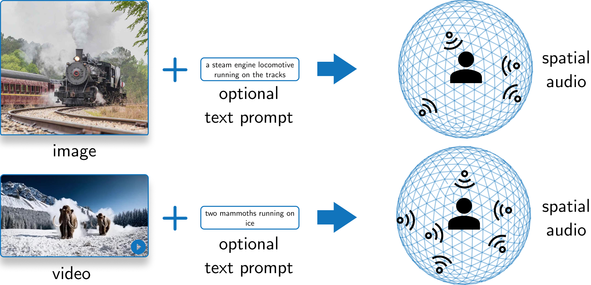
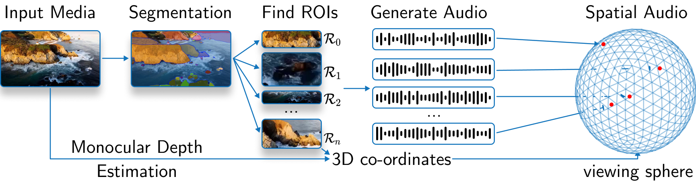

<div align="center">
<h2>SEE-2-SOUND🔊: Zero-Shot Spatial Environment-to-Spatial Sound</h2>

[**Rishit Dagli**](https://rishitdagli.com/)<sup>1</sup> · [**Shivesh Prakash**](https://shivesh777.github.io/)<sup>1</sup> · [**Rupert Wu**](https://www.cs.toronto.edu/~rupert/)<sup>1</sup> · [**Houman Khosravani**](https://scholar.google.ca/citations?user=qzhk98YAAAAJ&hl=en)<sup>1,2,3</sup>

<sup>1</sup>University of Toronto&emsp;&emsp;&emsp;&emsp;<sup>2</sup>Temerty Centre for Artificial Intelligence Research and Education in Medicine&emsp;&emsp;&emsp;&emsp;<sup>3</sup>Sunnybrook Research Institute

<a href="https://twitter.com/intent/tweet?text=Wow:&url=https%3A%2F%2Fgithub.com%2Fsee2sound%2Fsee2sound">
  
</a>
<a href="https://arxiv.org/abs/2406.06612"></a>
<a href='https://see2sound.github.io'></a>
</div>

This work presents **SEE-2-SOUND**, a method to generate spatial audio from images, animated images, and videos to accompany the visual content. Check out our [website](https://see2sound.github.io) to view some results of this work.



## Installation

You could also skip this section and run this entirely in a docker container, for which you can find the instructions in [Run in Docker](#run-in-docker).

First, install the pip package by running:

```sh
pip install see2sound
```

Now, install all the required packages:

```sh
git clone https://github.com/see2sound/see2sound
cd see2sound
pip install -r requirements.txt
```

Evaluating the code (not inference though) requires the [Visual Acoustic Matching](https://github.com/facebookresearch/visual-acoustic-matching) (AViTAR) codebase. However, due to the many changes required to run AViTAR, you should install the codebase through a [fork](https://github.com/Rishit-dagli/visual-acoustic-matching-s2s) we host. Install this by running:

```sh
pip install git+https://github.com/Rishit-dagli/visual-acoustic-matching-s2s
```

<div align="center">OR</div>

```sh
git clone https://github.com/Rishit-dagli/visual-acoustic-matching-s2s
cd visual-acoustic-matching-s2s
pip install -e .
```

Check out the [Tips](#tips) section for tips on installing the requirements.

## Overview of codebase

SEE-2-SOUND consists of three main components: source estimation, audio generation, and surround sound spatial audio generation.



In the source estimation phase, the model identifies regions of interest in the input media and estimates their 3D positions on a viewing sphere. It also estimates the monocular depth map of the input image.

Next, in the audio generation phase, the model generates mono audio clips for each identified region of interest, leveraging a pre-trained CoDi model. These audio clips are then combined with the spatial information to create a 4D representation for each region.

Finally, the model generates 5.1 surround sound spatial audio by placing sound sources in a virtual room and computing Room Impulse Responses (RIRs) for each source-microphone pair. Microphones are positioned according to the 5.1 channel configuration, ensuring compatibility with prevalent audio systems and enhancing the immersive quality of the audio output.

For evaluation, we propose a new quantitative evaluation technique and also do a user study. We propose a new method due to the difficulty in evaluating such a system, especially in the absence of any baselines. For quantitative evaluation, we produce outputs from an image to audio system ([CoDi](http://arxiv.org/abs/2305.11846)) which serves as a baseline and our system. We then run these approaches through [AViTAR](https://arxiv.org/abs/2202.06875) which edits the audio to match the visual content and then we compute similarity scores between pairs of these audio for each image.

### inference

The `See2Sound` class has a few main methods:

- `setup` that downloads and loads models into memory (in high memory mode)
- `adjust_audio` that simulates a room and computes the spatial audio
- `run` that puts together inference code

### evaluation

The `eval_See2Sound` class has a few main methods

- `setup` to download and load models into memory (in high memory mode)
- `generate_audio` to generate mono audio
- `run_avitar` to run the AViTAR model
- `compute_acoustic_similarity` to compute quantitative metrics

## Usage

Here is a guide on using this codebase in general it should be relatively quick to get started with this since it's well packaged as a `pip` package.

All of the code is designed to be run from the root of this repository.

### inference

```py
import see2sound


config_file_path = "default_config.yaml"

model = see2sound.See2Sound(config_path = config_file_path)
model.setup()
model.run(path = "test.png", output_path = "test.wav")
```

### evaluation

You should only run evaluation to do any quantitative evaluations with the quantitative evaluation method we propose in our work.

```py
from see2sound.evaluation import eval_See2Sound


image_dir_path = "path to a directory with all images"

evaluator = evalSee2Sound(config_path = config_file_path)
evaluator.setup()
evaluator.evaluate(image_dir_path)
```

## Run in Docker

You could run the inference and evaluation in a container, for the purpose of writing a guide to run the container image we use Docker. However, you should be able to use any other container runtime too.

Start by building the container image by running:

```sh
docker build . -t rishitdagli/see2sound:latest
```

or you can also directly use the prebuilt image (41 GB compressed):

```
docker pull rishitdagli/see2sound:latest
```

You can now use `docker run` and start running inference or evaluation in the container with the environment setup and models pre-downloaded for you.

## Tips

We share some tips on running the code and reproducing our results.

### on installing required packages

- You could find some ways to perform the quantitative evaluation with the original [Visual Acoustic Matching](https://github.com/facebookresearch/visual-acoustic-matching) repository, we would, however, suggest using the [fork](https://github.com/Rishit-dagli/visual-acoustic-matching-s2s) which has some additional features which are required if you want to run our code from the `pip` package.
- The repository has the dependency `tensorflow` which is required by `speech_metrics` and `vam`. However, this is only needed for the quantitative evaluations in our work and not for inference.
- Our codebase works with PyTorch 2.x, to this extent all of our code and results were produced with PyTorch 2.3.0, our `requirements.txt` file, however, has PyTorch 1.13.1 since PyTorch 1.x is required for our quantitative evaluation.

### on downloading models

- If you are running inference, the code downloads a few artifacts: Segment Anything weights, Depth Anything weights, CoDi weights, and CLIP ViT-H Tokenizer.
- If you are running evaluation, the code downloads a few artifacts: Segment Anything weights, Depth Anything weights, CoDi weights, CLIP ViT-H Tokenizer, and AViTAR weights.
- The paths to all of these files can be entered in the config `yaml` where the package will look for them or download them at. Thus one could make the inference or evaluation run without any network connection.

### on compute

- We have currently optimized the code for and run all of the experiments on a A100 - 80 GB GPU. However, we have also tested the code on a A100 - 40 GB GPU, a H100 - 80 GB GPU, and a V100 - 32 GB GPU (run with the low memory mode) where the inference and evaluation seem to work pretty fast.
- In general, we would recommend a GPU above 40 GB vRAM, you could, however, run this on a GPU with 24 GB or more vRAM in the low memory mode (trades off-peak vRAM usage with the time taken).
- We would recommend having at least 24 GB CPU RAM for the code to work well, ideally, we would recommend 32 GB CPU RAM though.

### on running inference

- All of our experiments were run with Segment Anything ViT-H and Depth Anything ViT-L. However, any of the models can be replaced for the smaller variants through the config `yaml` file or also different models altogether.
- We would suggest running the inference for at least 500 diffusion steps and somewhere between 3 to 5 as `num_audios`.

## Credits

This code base is built on top of, and thanks to them for maintaining the repositories:

- [CoDi](https://github.com/microsoft/i-Code/tree/main/i-Code-V3)
- [Segment Anything](https://github.com/facebookresearch/segment-anything)
- [Depth Anything](https://github.com/LiheYoung/Depth-Anything/tree/main)
- [Visual Acoustic Matching](https://github.com/facebookresearch/visual-acoustic-matching)

## Citation

If you find See-2-Sound helpful, please consider citing:

```bibtex
@misc{dagli2024see2sound,
      title={SEE-2-SOUND: Zero-Shot Spatial Environment-to-Spatial Sound}, 
      author={Rishit Dagli and Shivesh Prakash and Robert Wu and Houman Khosravani},
      year={2024},
      eprint={2406.06612},
      archivePrefix={arXiv},
      primaryClass={cs.CV}
}
```
